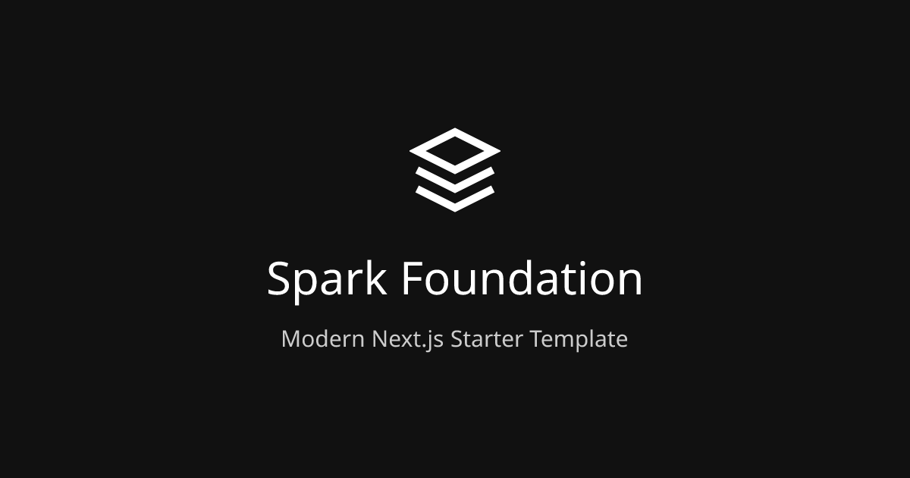

# 📊 Market Sidekick

> 🚀 Simplifying financial decisions for long-term investors

Market Sidekick is a financial tool designed to help long-term investors make more informed decisions by providing clear, simplified market indicators, stock analysis, and guided reflection before making investment decisions.



## 🌟 Introduction

### 🔍 What is Market Sidekick?

Market Sidekick is a modern web application that transforms complex financial data into accessible insights for individual investors. It provides a comprehensive dashboard of market indicators with plain-language explanations, a watchlist for tracking potential investments, detailed stock analysis, and a structured reflection process to encourage thoughtful investment decisions.

### 🤔 Problem Statement

Individual investors face several challenges in today's complex financial markets:

1. **Information Overload**: Financial markets generate overwhelming amounts of data, making it difficult to identify what's truly relevant.
2. **Technical Complexity**: Market indicators and financial metrics often require specialized knowledge to interpret correctly.
3. **Emotional Trading**: Investment decisions are frequently driven by emotions rather than rational analysis, leading to poor outcomes.
4. **Lack of Reflection**: Investors often don't document their reasoning for trades, missing opportunities to learn from past decisions.
5. **Unclear Market Context**: Understanding the broader market environment and how it affects individual investments can be challenging.

### 👥 Target Users

- **Primary**: Long-term individual investors who want to make informed decisions without becoming full-time traders
- **Secondary**: Investment education seekers who are learning about financial markets and investing

## ✨ Core Features

### 📈 Market Dashboard

- **Key Market Indicators**: Visual representation of market health with status indicators
- **Indicator Details**: Expandable cards with detailed information and historical context
- **AI-Powered Explanations**: Plain-language explanations of complex financial concepts
- **Price Tracking**: Real-time prices for major market indices
- **Interactive Visualizations**: Sparklines and charts for important metrics

### 👁️ Stock Watchlist

- **Customizable Tracking**: Monitor potential investments with personalized watchlists
- **Technical & Fundamental Metrics**: Display key stock data including price, RSI, moving averages
- **Visual Indicators**: Color-coded metrics for quick status assessment
- **Sorting & Filtering**: Organize stocks based on various criteria
- **Quick Access**: Direct links to detailed stock views

### 🔎 Stock Detail View

- **Comprehensive Metrics**: In-depth technical and fundamental data
- **Price History**: Visual representation of historical performance
- **AI Analysis**: Automated insights about the stock's current position
- **Decision Support**: Direct links to the reflection tool for buy/sell decisions

### 🧠 Reflection Tool

- **Guided Decision Process**: Structured questionnaire before executing trades
- **Investment Reasoning**: Capture your rationale for buy/sell decisions
- **Historical Record**: Store past decisions for future review and learning
- **Emotion Mitigation**: Tools to reduce impulsive trading behaviors

### ⚙️ Settings & Preferences

- **Theme Customization**: Light and dark mode options
- **Display Preferences**: Customize which metrics and indicators are shown
- **Notification Settings**: Configure alerts for price movements or indicator changes
- **API Key Management**: Connect to various financial data sources

## 🛠️ Technical Stack

Market Sidekick is built with modern web technologies:

- **Next.js 15** with App Router architecture
- **React 19** for UI components
- **TypeScript** for type safety
- **Tailwind CSS** for styling
- **shadcn/ui** for accessible, customizable components
- **recharts** for data visualization
- **Zod** for schema validation
- **Local Storage** for client-side persistence

## 📁 Project Structure

```
market-sidekick/
├── app/                  # Next.js App Router pages
│   ├── page.tsx          # Home page (Dashboard)
│   ├── layout.tsx        # Root layout
│   ├── globals.css       # Global styles
│   └── api/              # API routes
├── components/           # Shared components
│   ├── ui/               # Base UI components (shadcn)
│   ├── dashboard/        # Dashboard-specific components
│   │   ├── indicator-card.tsx        # Market indicator card
│   │   ├── market-price-card.tsx     # Market price display
│   │   ├── stock-table.tsx           # Watchlist table
│   │   └── chart-component.tsx       # Chart visualizations
│   ├── dialogs/          # Dialog components
│   └── icons/            # Icon components
├── hooks/                # Custom React hooks
├── lib/                  # Utility functions and helpers
│   ├── api/              # API utilities
│   ├── storage/          # Local storage utilities
│   └── utils/            # Helper functions
├── public/               # Static assets
└── memory-bank/          # Project documentation
```

## 🚀 Getting Started

### 📋 Prerequisites

- **Node.js 18.17.0 or later** - [Download from nodejs.org](https://nodejs.org/)
- **npm 9.6.0 or later** - Included with Node.js installation
- **Git** - [Download from git-scm.com](https://git-scm.com/downloads)

### 🔧 Installation & Setup

1. **Clone the repository:**
   ```bash
   git clone https://github.com/your-username/market-sidekick.git
   cd market-sidekick
   ```

2. **Install dependencies:**
   ```bash
   npm install
   ```

3. **Run the development server:**
   ```bash
   npm run dev
   ```

4. **View the application:**
   - Open [http://localhost:3000](http://localhost:3000) in your browser
   - The dashboard should load automatically with mock data

### 💻 Development Commands

```bash
# Start development server
npm run dev

# Build for production
npm run build

# Start production server
npm run start

# Run tests
npm test
```

## 🏗️ Current Status

Market Sidekick is in active development. Here's the current status:

### ✅ Implemented Features

- **Core Application Structure**: Next.js project setup with TypeScript, Tailwind CSS, and shadcn/ui
- **Layout and Navigation**: Main application layout with header, footer, and theme toggle
- **Market Dashboard**: 
  - Dashboard layout with responsive grid
  - Market price display for major indices
  - Key market indicators with status badges
  - AI-powered explanations (accessible via "Ask AI" sheet)
  - Interactive indicator cards with hover effects and dialog popups
  - Top Watchlist table with stock data

### 🔄 In Progress

- **Indicator Card Dialog Enhancement**: Making dialog content dynamic based on the specific indicator
- **Watchlist Screen**: Full implementation planned, will utilize existing StockTable component

### 📝 Not Yet Implemented

- **Stock Detail View**: Individual stock pages with comprehensive metrics
- **Reflection Tool**: Guided reflection forms for investment decisions
- **Settings Page**: Theme customization and preference management
- **API Integrations**: Currently using mock data, real API integrations pending

### ⚠️ Known Issues

- All data is currently static/mock data
- StockTable component has JSX escaping issues in the legend section
- Indicator dialogs show static content and need to be made dynamic

## 🏛️ Architecture & Design

### 🧩 Component Patterns

- **Compound Components**: Complex UI elements broken down into subcomponents
- **Presentational and Container Components**: Separation between data/logic handling and presentation
- **Component Composition**: Building complex interfaces from simpler components

### 🔄 Data Flow Patterns

- **Server Component Data Fetching**: Data is fetched server-side in server components
- **Client-Side State Management**: React hooks for component-level state
- **TypeScript Interface Contracts**: Clear data interfaces between components

### 🎨 UI Patterns

- **Responsive Design System**: Mobile-first approach using Tailwind breakpoints
- **Consistent Status Indicators**: Color coding for indicating status (normal, warning, danger)
- **Interactive Component Feedback**: Hover effects with visual elevation
- **Progressive Disclosure**: Essential information first, with dialogs for details

### 🔗 Component Relationships


## 🤝 Contributing

We welcome contributions to Market Sidekick! Here's how you can contribute:

1. Fork the repository
2. Create a feature branch: `git checkout -b feature/your-feature-name`
3. Commit your changes: `git commit -m 'Add some feature'`
4. Push to the branch: `git push origin feature/your-feature-name`
5. Open a pull request

### 📏 Coding Standards

- Follow TypeScript best practices
- Use Tailwind CSS for styling
- Implement responsive design for all components
- Write clean, maintainable code with proper comments
- Create reusable components when possible

## 📄 License

This project is licensed under the MIT License - see the LICENSE file for details.
