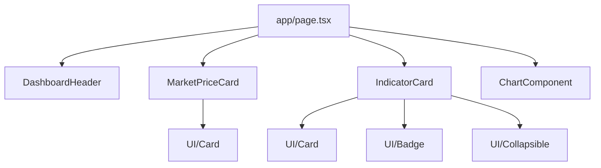
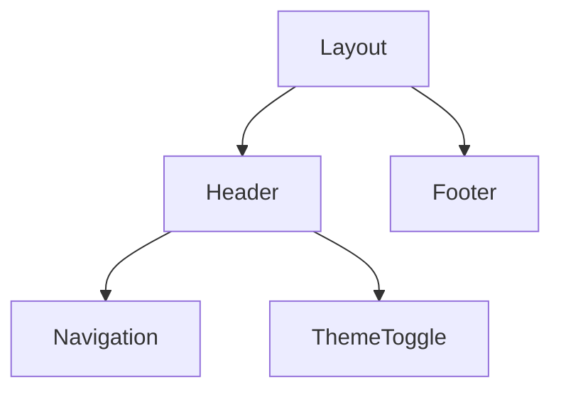

# Market Sidekick - System Patterns

## System Architecture

Market Sidekick follows a modern Next.js 15 application architecture, leveraging the App Router paradigm for efficient page loading and component rendering. The architecture is designed around these key principles:

### Core Architectural Patterns

1. **Server-Side Rendering (SSR) First**
   - Main pages are server components by default
   - Data fetching occurs on the server when possible
   - Client components are used only when necessary (interactivity, state)

2. **Component-Based Structure**
   - Organized by feature and responsibility
   - UI components are separated from business logic
   - Reusable components are isolated in their own directories

3. **Layered Architecture**
   - Presentation layer (components)
   - Business logic layer (hooks, utilities)
   - Data access layer (API routes, local storage)

## Directory Structure

The application follows a structured organization pattern:

```
market-sidekick/
├── app/                  # Next.js App Router pages
│   ├── page.tsx          # Home page (Dashboard)
│   ├── layout.tsx        # Root layout
│   ├── watchlist/        # Watchlist feature
│   ├── stocks/           # Stock details feature
│   ├── reflection/       # Reflection tool feature
│   ├── settings/         # Settings feature
│   └── api/              # API routes
├── components/           # Shared components
│   ├── ui/               # Base UI components (shadcn)
│   ├── dashboard/        # Dashboard-specific components
│   ├── watchlist/        # Watchlist-specific components
│   └── [feature]/        # Feature-specific components
├── hooks/                # Custom React hooks
├── lib/                  # Utility functions and helpers
├── public/               # Static assets and files
│   ├── plans/            # Project planning documents
│   └── progress/         # Progress tracking
└── memory-bank/          # Project documentation
```

## Key Technical Decisions

1. **Next.js App Router**
   - Selected for its improved performance and simplified routing model
   - Enables RSC (React Server Components) for reduced client-side JavaScript
   - Simplifies API route creation and data fetching patterns

2. **TypeScript**
   - Used throughout the codebase for type safety
   - Interface-driven development for component props
   - Type checking for API responses and state management

3. **Tailwind CSS**
   - Utility-first approach for styling
   - Component-specific styling using composition
   - Responsive design patterns using Tailwind breakpoints

4. **shadcn/ui Component Library**
   - Accessible, customizable UI components
   - Consistent styling and behavior across the application
   - Component variants for different use cases

5. **Client-Side Storage**
   - Local storage for user preferences and settings
   - Zod validation for type-safe client-side data

6. **AI Integration**
   - Vercel AI SDK for generating explanations
   - Integration with OpenAI's models for financial insights

## Design Patterns

### Component Patterns

1. **Compound Components**
   - Complex UI elements are broken down into subcomponents
   - Components expose a clear API through props
   - Example: `IndicatorCard` with its internal subcomponents

2. **Presentational and Container Components**
   - Separation between data/logic handling and presentation
   - Container components fetch data and manage state
   - Presentational components focus on rendering and UI

3. **Component Composition**
   - Building complex interfaces from simpler components
   - Leveraging children props for flexible layouts
   - Using layout components for consistent page structure

### Data Flow Patterns

1. **Server Component Data Fetching**
   - Data is fetched server-side in server components
   - Props are passed down to client components
   - Reduced client-side JavaScript and improved performance

2. **Client-Side State Management**
   - React hooks for component-level state
   - Context API for shared state across components
   - Custom hooks for reusable state logic

3. **TypeScript Interface Contracts**
   - Clear data interfaces between components
   - Type-safe props for component APIs
   - Zod schemas for runtime validation

### UI Patterns

1. **Responsive Design System**
   - Mobile-first approach using Tailwind breakpoints
   - Consistent spacing and sizing scale
   - Adaptive layouts based on screen size

2. **Consistent Status Indicators**
   - Color coding for indicating status (normal, warning, danger)
   - Visual patterns for representing data trends
   - Badges and icons for quick visual recognition

3. **Progressive Disclosure**
   - Show essential information first
   - Expand/collapse patterns for additional details
   - Collapsible sections for explanations and analysis

## Component Relationships

### Dashboard Page



The dashboard page integrates several key components:
- `DashboardHeader` for page title and actions
- `MarketPriceCard` for displaying market prices
- `IndicatorCard` for showing market indicators with explanations
- `ChartComponent` for visualizing market trends

### Shared Components



The application uses a consistent layout pattern with:
- `Header` containing navigation and theme controls
- `Footer` with additional links and information
- `Navigation` for moving between different sections of the app
- `ThemeToggle` for switching between light and dark modes

## State Management Patterns

1. **User Preferences**
   - Theme preferences stored in local storage
   - Settings managed through React Context
   - Type-safe storage with Zod validation

2. **Watchlist State**
   - Stock data cached locally
   - CRUD operations for managing watchlist entries
   - Persistence between sessions

3. **UI State**
   - Component-level state for UI interactions
   - Collapsible sections for explanations
   - Modal and dialog states

## API Integration Patterns

1. **Market Data Fetching**
   - Server-side data fetching for market indicators
   - Typed API responses with TypeScript interfaces
   - Error handling and loading states

2. **AI Explanation Generation**
   - Server-side API routes for AI interactions
   - Streaming responses for real-time explanations
   - Caching strategies for performance optimization

## Testing Patterns

1. **Component Testing**
   - Unit tests for individual components
   - Integration tests for component interactions
   - Accessibility testing for UI components

2. **Data Validation**
   - Schema validation for API responses
   - Type checking for component props
   - Runtime validation with Zod
